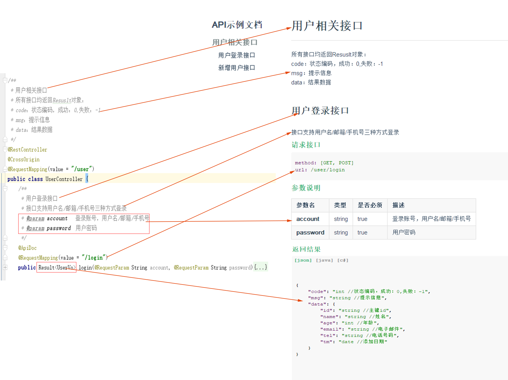

# simple-apidoc
一个简单、好用的spring/springboot应用接口文档生成工具
  
# 特点
1. 提供详细的接口信息，包括请求地址、参数、返回值以及必要的说明
2. 代码即文档，根据注释快速生成，及时更新
3. 界面美观，方便前端用户查看  
4. 全部接口生成一个html,方便拷贝
5. 多种返回值代码模型，json、java、c#方便前端调用
总结：简单、好用、美观
# Maven 和 Gradle
 
# 快速使用
一张图就很清楚  

# 其他文档工具
 - [swagger-ui](https://github.com/swagger-api/swagger-ui)：使用最广泛的工具。 但是界面很不好看，不能提供返回值说明，最主要的是它需要写一遍注解，让人很不爽。
 - [JApiDocs](https://gitee.com/yeguozhong/JApiDocs)：非常好用，基于注释生成文档，不需要写注解。
 一开始用的也是这个，之后有人提出界面不好看，接口多了之后不好找，不支持添加说明等问题，于是在此基础上开发了这个工具。
 
为了满足用户需求，本着简单、好用、美观的原则，在[JApiDocs](https://gitee.com/yeguozhong/JApiDocs)基础上进行了修改和定制，弄了这个simple-apidoc，
本就是用别人开源的东西修改的，不敢独享，分享出来给喜欢的人使用。
